# Module 4: Exporting for Forensic Analysis

In this module we will discuss methods for exporting a machine image of a compromised EC2 instance for forensic analysis.  We will be exploring two different export scenarios:

    1. Creating a snapshot of the compromised machine and sharing it with a second AWS account (such as the central infosec account).
    2. Creating an image of the server's block devices for download to a non-AWS environment for analysis (such as exporting to an on-prem forensic environment).
    
The CloudFormation script you executed in Module 2 installed an EC2 instance in us-west-2.  

First, pair off with a partner for this exercise.  You'll be sharing your snapshot of the compromised machine with your partner's AWS account, simulating that their account is the cloud forensic account.

Next, log in to your account and make sure you're in Oregon (us-west-2).  Make a note of your account ID by clicking on the role drop-down in the upper right hand side of the AWS console:

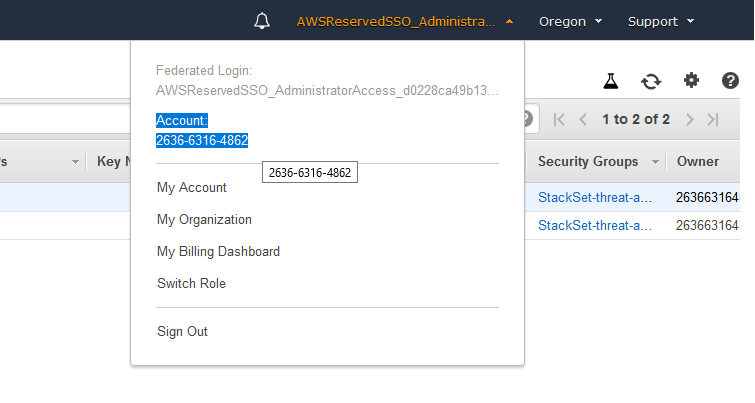

 Navigate to the EC2 service and select the EC2 instance with the name "threat-detection-wksp: Compromised Instance".  Make a note of the instance id, you'll need it to find the EBS volume(s) associated with the account.

Next, navigate to the "Volumes" option on the left-hand side of the page.  On the Volumes page, find the volume(s) attached to the EC2 instance ID:

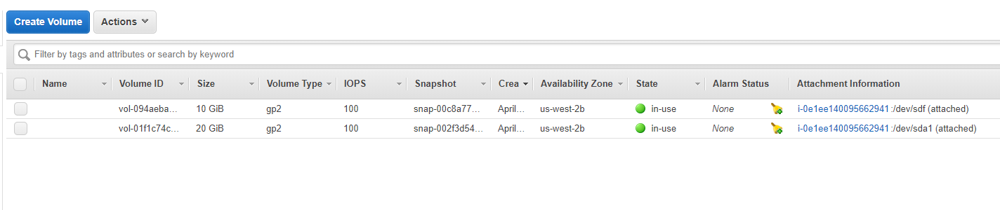

Select the volume, and go to Actions -> Create Snapshot.  Add a description for the snapshot, and create a new tag with a key of "Description" and a value of "forensics".  Note: in a real life scenario you can tag a snapshot with a ticket or incident ID to facilitate tracking.  

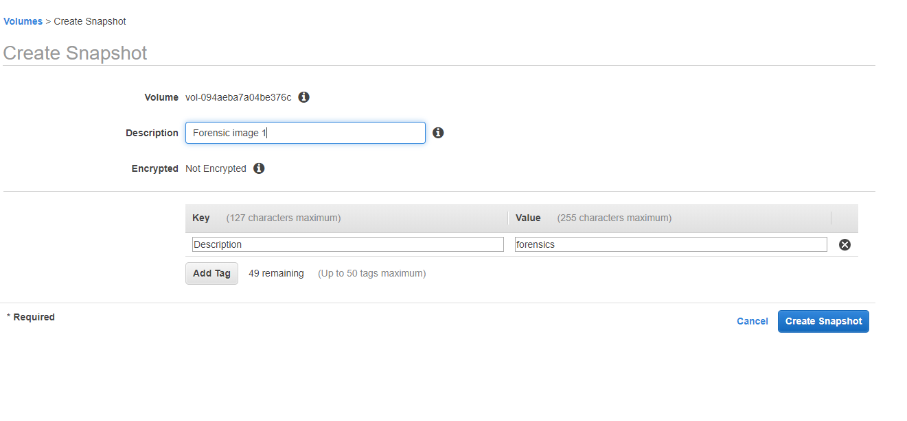

Next, go to the Snapshots menu on the left hand side.  You'll see the  forensic snapshot listed:

Select the snapshot, and go to Actions -> Modify Permissions.  In this section, enter the AWS account number of your partner's account.  

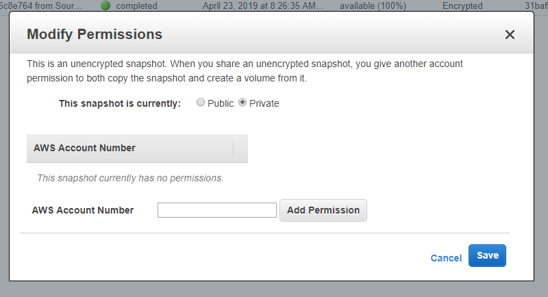

After you and your partner have completed this section, you should be able to refresh the Snapshots screen and see your partner's shared snapshot.  In this scenario, the source account still owns the snapshot, and can choose to stop sharing or delete the snapshot at will.  Since this is part of a forensic investigation, we're going to copy the shared snapshot in to your account, the forensics account, so that there is a permanent record.  

Select the snapshot shared with your account, and go to Actions -> Copy.  Here you can choose to encrypt the snapshot with a key in your own account as well.  Copy the snapshot to your account.  Note down the description and Snapshot ID of the newly copied snapshots.  

Reminder: We're doing this step to fully copy the snapshot into our local account, which is the information security/forensics account.

Next, we're going to create an EC2 instance where we can mount our snapshot for forensic investigation.  Go to the Instances menu on the left hand side and select "Launch Instance".  

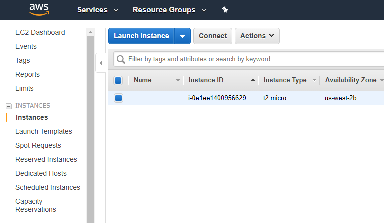

Select the Amazon Linux 2 AMI using 64-bit (x86) architecture, and hit "Select".  

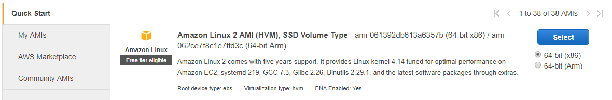

On the next screen, select a t2.micro instance and select "Review and Launch", then hit the blue "Launch" button in the lower-right hand side of the screen.    

Create a new key pair, and download the PEM key.  Note, if you use Putty for your terminal you'll need to convert the PEM key to a PPK key using Puttygen, <a href="https://docs.aws.amazon.com/AWSEC2/latest/UserGuide/putty.html" target="_blank">click here for more information</a>.  

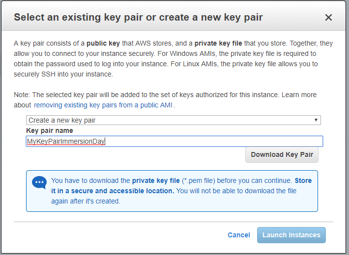

Next, find the IP address for your newly create instance (if you click on the instance it's the Public DNS (IPv4) address listed, it will look like ec2-00-00-00-00.us-west2.compute.amazonaws.com).  Log in to the EC2 instance using Putty or a terminal of your choice.  The login user is "ec2-user" and no password is needed since we're using keyed SSH.  Make a note of which availability zone your instance is in, and the instance ID - we'll need that for the next step! 

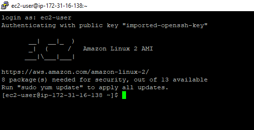

Next we're going to convert the snapshot to an EBS volume so we can mount it to a server for additional investigation.  Browse to the snapshots menu on the left hand side, then select the newly created snapshot and go to Actions -> Create volume and create the volume.  Make sure you change the availability zone to match the zone your instance was created in just a moment ago, EBS volumes can only be mapped to EC2 instances in the same availability zone.  Note the volume ID after creation:

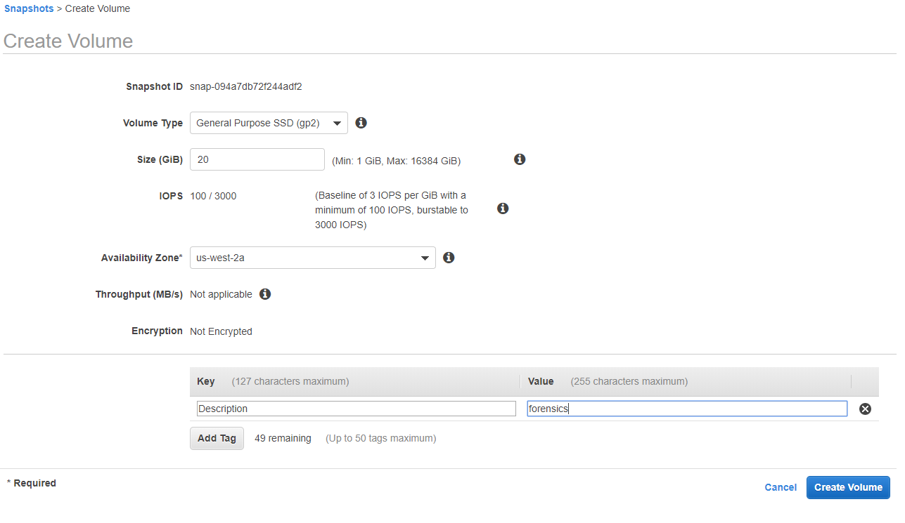

Browse to the Volumes menu on the left hand side and you should see your new volume.  Select the volume, go to Actions -> Attach volume, and click in the "Instance" field of the pop-up.  This should contextually bring up the EC2 instances you can attach the volume to - attach it to the instance ID for the instance we just created. 

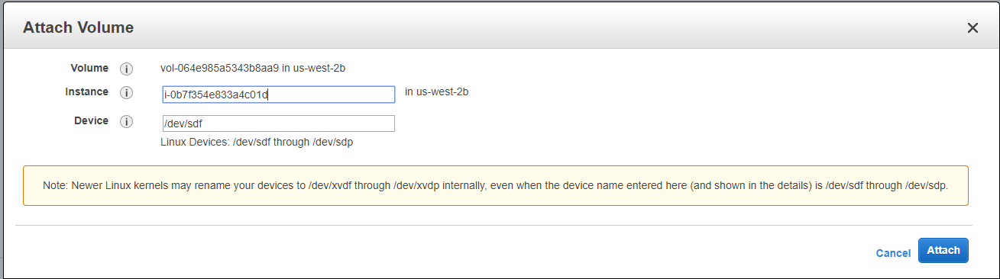


Switch back to Putty (or your terminal of choice) and type `sudo dmesg | tail -n 5`:

```
[ec2-user@ip-172-31-60-74 ~]$ sudo dmesg | tail -n 5
[    4.033559] RPC: Registered tcp NFSv4.1 backchannel transport module.
[    4.118619] random: crng init done
[    4.118620] random: 7 urandom warning(s) missed due to ratelimiting
[16478.272851] blkfront: xvdf: barrier or flush: disabled; persistent grants: disabled; indirect descriptors: enabled;
[16478.332461]  xvdf: xvdf1
```

We can see that /dev/xvdf1 has been attached to the instance (note: your device ID may be different!), and we can confirm with fdisk:

```
[ec2-user@ip-172-31-60-74 ~]$ sudo fdisk -l /dev/xvdf
Disk /dev/xvdf: 15 GiB, 16106127360 bytes, 31457280 sectors
Units: sectors of 1 * 512 = 512 bytes
Sector size (logical/physical): 512 bytes / 512 bytes
I/O size (minimum/optimal): 512 bytes / 512 bytes
Disklabel type: gpt
Disk identifier: 9B950845-EC1C-437D-8C99-7E0207F60000

Device       Start      End  Sectors Size Type
/dev/xvdf1    4096 31457246 31453151  15G Linux filesystem
/dev/xvdf128  2048     4095     2048   1M BIOS boot

Partition table entries are not in disk order.
```

In this case, because the filesystem is already present on the device, we can mount the partition using the following commands (please also enter them in your terminal):

```
sudo mkdir /mnt/forensics
sudo mount -o ro /dev/xvdf1 /mnt/forensics
cd /mnt/forensics
```

From there we can browse the contents of the compromised server's drive.  

# Exporting an image outside of AWS

To export this compromised drive outside of AWS, first we need to create a destination volume to hold the disk image.  In the AWS console, browse to Services -> EC2, then select "Volumes" on the left-hand menu.  

Create a new volume, and make sure it's in the same availability zone as your forensic EC2 instance.  Make the volume twice as large as the compromised machine's volume, or 16GB.  Make a note of the volume ID after creation.

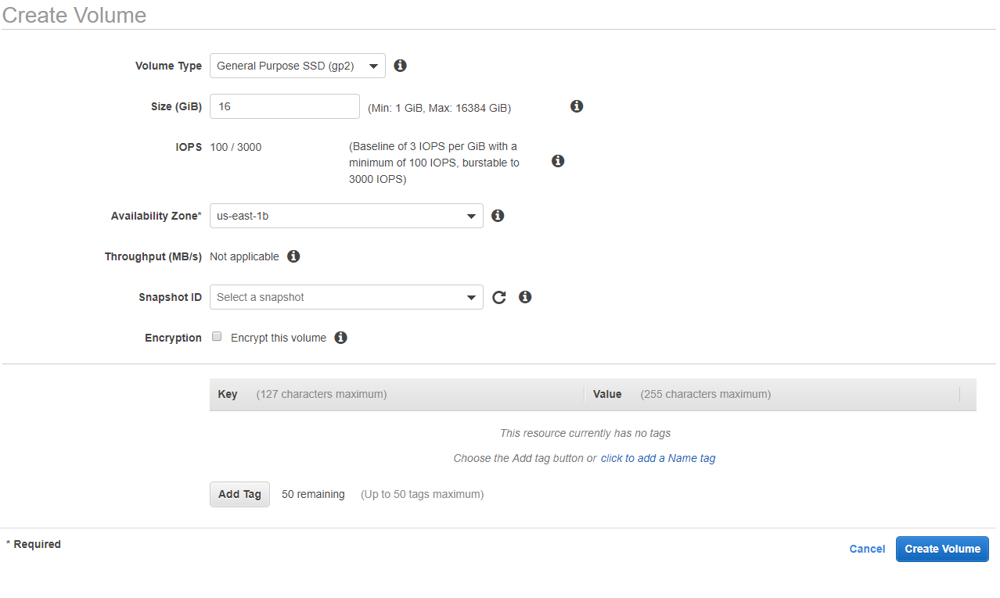

Find the new volume in your volumes list, and go to Actions -> Attach volume.  Enter the instance ID of your forensic EC2 instance.  

Switch back to Putty (or your terminal of choice) and type `sudo dmesg | tail -n 5`:

```
[ec2-user@ip-172-31-60-74 ~]$ sudo dmesg | tail -n 5
[    4.118619] random: crng init done
[    4.118620] random: 7 urandom warning(s) missed due to ratelimiting
[16478.272851] blkfront: xvdf: barrier or flush: disabled; persistent grants: disabled; indirect descriptors: enabled;
[16478.332461]  xvdf: xvdf1
[17384.051945] blkfront: xvdg: barrier or flush: disabled; persistent grants: disabled; indirect descriptors: enabled;
```

The new volume that was just attached to the instance is /dev/xvdg.  Unlike the forensic snapshot, this block device does not have a filesystem or partition, so we'll go ahead and create those (enter these commands in your command prompt).

```
sudo parted /dev/xvdg -- mklabel gpt
sudo parted /dev/xvdg --mkpart primary 0% 100%
sudo mkfs.ext4 /dev/xvdg1
sudo mkdir /mnt/exports
sudo mount /dev/xvdg1 /mnt/exports
```

Now there is a new 16GB volume mounted at /mnt/exports:

```
[ec2-user@ip-172-31-60-74 ~]$ df -lh
Filesystem      Size  Used Avail Use% Mounted on
devtmpfs        2.0G     0  2.0G   0% /dev
tmpfs           2.0G     0  2.0G   0% /dev/shm
tmpfs           2.0G  432K  2.0G   1% /run
tmpfs           2.0G     0  2.0G   0% /sys/fs/cgroup
/dev/xvda1       15G  1.6G   14G  11% /
tmpfs           395M     0  395M   0% /run/user/1000
/dev/xvdg1       16G   45M   15G   1% /mnt/exports
```

We're going to use `dd` to create a disk image of the entire volume of the compromised machine, including the boot partition:

```
[ec2-user@ip-172-31-60-74 exports]$ sudo dd if=/dev/xvdf bs=4K conv=sync,noerror | sudo tee /mnt/exports/forensic_image.img | md5sum > ~/forensic_image.md5
3932160+0 records in
3932160+0 records out
16106127360 bytes (16 GB) copied, 251.502 s, 64.0 MB/s
[ec2-user@ip-172-31-60-74 exports]$ cat ~/forensic_image.md5
cc4d4a886ced224f729a5fa0a45df39d  -
```

This command is a bit lengthy, but the command uses dd with an input file of /dev/xvdf.  The sync and noerror options tell the dd program not to quit if there is a read error from the volume, and to null-fill the rest of the block if there is an error.  The command uses tee to write the image to /mnt/exports, and then pipes the output to md5sum which writes the MD5 hash of the file out to your user's home directory.  This command can take quite a while; we're cloning the entire disk, and then calculating a Md5 checksum on a roughly 8GB file!

Once this process completes, you will have a disk image in /mnt/exports that can be downloaded using SCP, or copied to S3 for later download.  

Congratulations, you've finished module 4!

